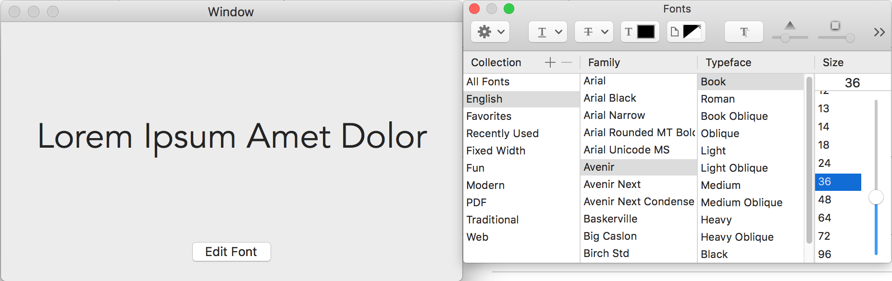

# NSFontPanelDemo

Sample macOS Cocoa app Xcode project demonstrating how to use NSFontPanel to let user change font.





The key is to implement the **changeFont(_ sender: Any?)** function in your view controller, or in the NSWindowController,  AppDelegate that is placed above in the [Responder Chain](#https://developer.apple.com/library/archive/documentation/Cocoa/Conceptual/EventOverview/EventArchitecture/EventArchitecture.html#//apple_ref/doc/uid/10000060i-CH3-SW2).

```swift
	override func changeFont(_ sender: Any?) {
		
		// the sender is a font manager
		guard let fontManager = sender as? NSFontManager else {
			return
		}
		
		// the newly selected font
		/*
			you can actually pass in any font into the .convert() function and it
			will return the selected font from the panel, lol
		*/
		
//		let newFont = fontManager.convert(NSFont.systemFont(ofSize: 13.0))
		let newFont = fontManager.convert(self.font)
		yourLabel.font = newFont
  }
```

